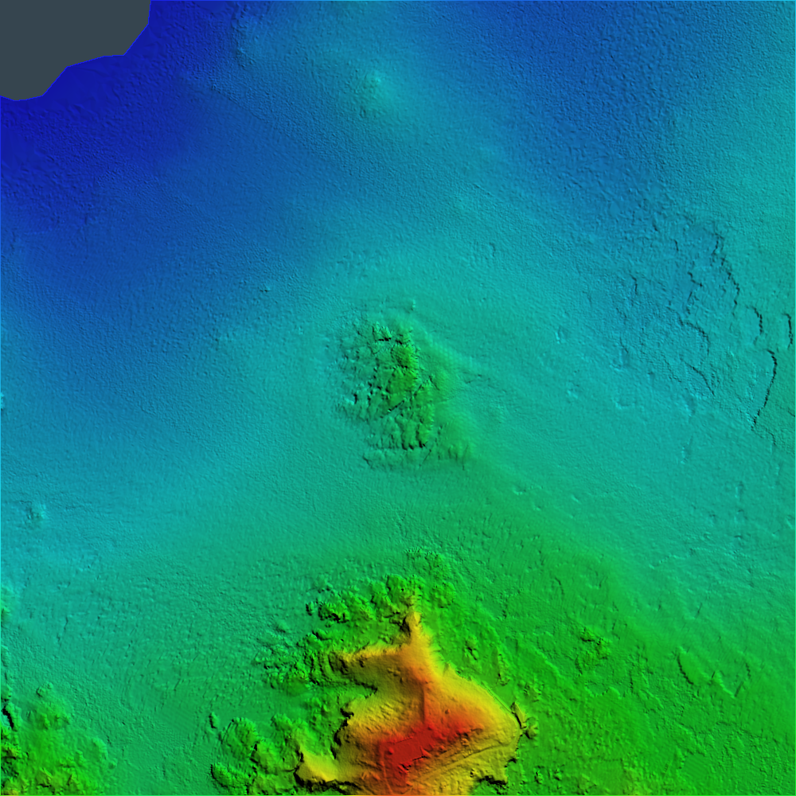
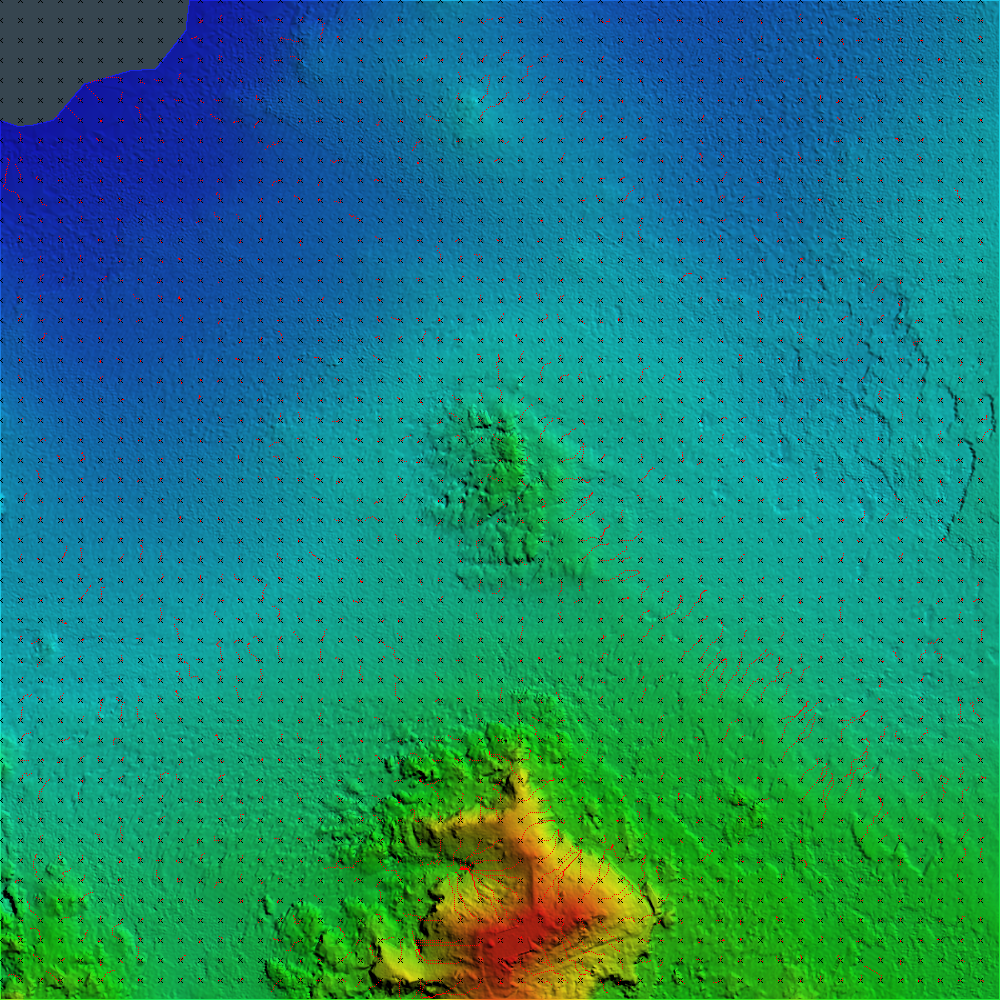

# Rust Project 2025 - MIR

## Developers
- Mateus Machado Pedrosa
- Ahmed Borchani

## About
This program was developed as the final assignment of the Introduction to Rust course from the MIR Erasmus Mundus Master's.

It opens an ASC file and generates a Digital Elevation Model (DEM) from the data, which is saved as 3 PNG images: one in grayscale, one following a color gradient and applying a hill shading algorithm, and one with a visualization of the gradient direction throughout the image.

Unit tests are provided in the main.rs file to assure everything is running as expected.

## How to run
- Make sure you have Rust installed
- Navigate to the root directory of the project in your terminal.
- Run the following command, replacing `<input-asc-file>` with the absolute path to the ASC file that you want to visualize as a DEM image:
    ```bash
    cargo run <input-asc-file>
    ```
- The program will process the file and generate the output PNG images in the same directory. The output images are named after the type of visualization: `grayscale.png`, `colored.png`, `gradient.png`.

## Custom Feature: Gradient Descent Visualization
This feature draws a grid of points on the image. From each point, it calculates the negative gradient and draws a dashed line following its direction until it reaches a local minimum. This visualization helps in understanding the gradient flow and the topography of the image.

## Examples

Below are examples of the three types of PNG images generated by the program:

1. **Grayscale DEM**  
   This image represents the elevation data in grayscale, where darker shades indicate lower elevations and lighter shades indicate higher elevations.  
   

2. **Colored DEM with Hill Shading**  
   This image uses a color gradient to represent elevation and applies a hill shading algorithm to enhance the topography.  
   

3. **Gradient Descent Visualization**  
   This image visualizes the gradient direction by drawing dashed lines from grid points, showing the flow towards local minima.  
   
